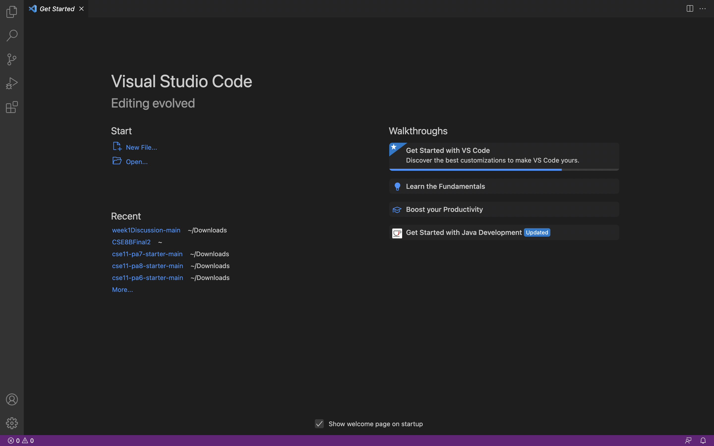
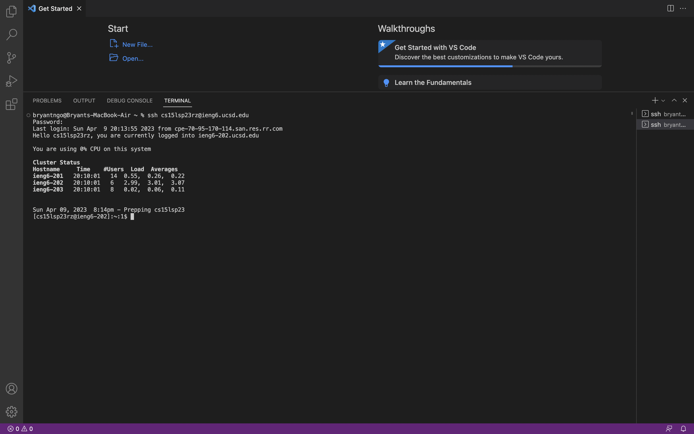
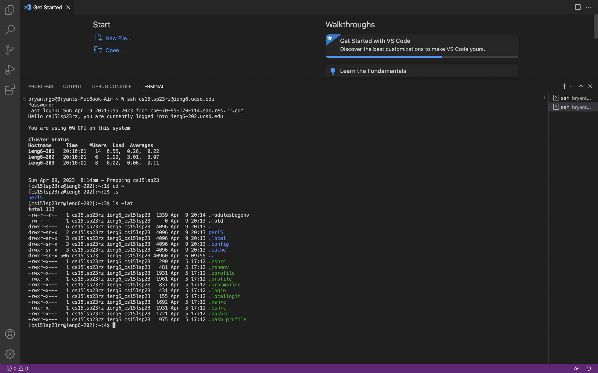

# How to log into a course-specific account on ieng6
## Installing VSCode
First, click the [Link](https://code.visualstudio.com/) to install VSCode. Follow the instructions and make sure to download with the right operating system.

After opening, it should like this: 

## Remotely Connecting
If you are on Windows, download git [here](https://gitforwindows.org). Since I am on a MacBook, I do not need to.

To use ssh, open the terminal (use the Terminal → New Terminal menu option) and enter the command `$ ssh cs15lsp23zz@ieng6.ucsd.edu` (the zz will be replaced by the letters in your course specific account, in my case, this will be replaced with rz). 

**Note:** the $ is just convention for how commands are written but do not type it in the terminal)

If it is your first time connecting, the terminal may ask you if you want to keep connecting, type yes.

After typing in your password, your terminal should look like this: 

**You are now connected to a computer in the CSE basement and all commands that are run will run on this computer!**

## Trying Some Commands
We can now type in some commands (cd, ls, pwd, mkdir, and cp). Trying typing these commands in the remote server as well as your personal computer.

```
* cd
* ls
* pwd
* mkdir
* cp
```

More specific commands: 

```
* cd ~
* cd
* ls -lat
* ls -a
* ls <directory> where <directory> is /home/linux/ieng6/cs15lsp23/cs15lsp23abc, where the abc is one of the other group members’ username
* cp /home/linux/ieng6/cs15lsp23/public/hello.txt ~/
* cat /home/linux/ieng6/cs15lsp23/public/hello.txt
```

Some output may look like this: 

**You have now successfully logged into a course specific account on ieng6!**

To log out of the server, you may use Ctrl-D or run the $ exit command.


