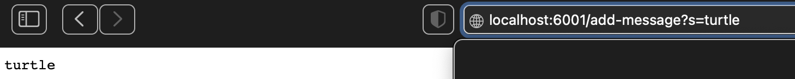

## Lab Report 2 - Servers and Bugs
Here is the code for StringServer: 
```
import java.io.IOException;
import java.net.URI;
import java.util.ArrayList;

class Handler implements URLHandler {
    String message = "";

    public String handleRequest(URI url) {
        if (url.getPath().contains("/add-message")) {
            String[] parameters = url.getQuery().split("=");
            if (parameters[0].equals("s")) {
                message += parameters[1] + "\n";
                return message;
            }
        }
        return "404 Not Found!";
    }
}

class StringServer {
    public static void main(String[] args) throws IOException {
        if (args.length == 0) {
            System.out.println("Missing port number! Try any number between 1024 to 49151");
            return;
        }

        int port = Integer.parseInt(args[0]);

        Server.start(port, new Handler());
    }
}
```

Here I am using:
.contains("/add-message")

.split("=")

.equals("s")

.add(parameters[1]), here the value is turtle


Here I am using: 

.contains("/add-message")

.split("=")

.equals("s")

.add(parameters[1]), here the value is turtle power


