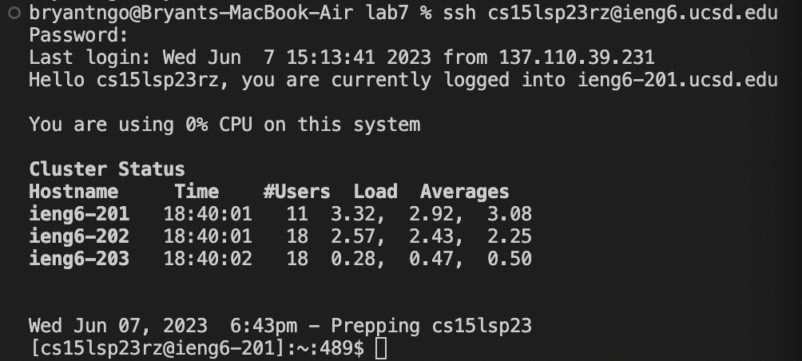
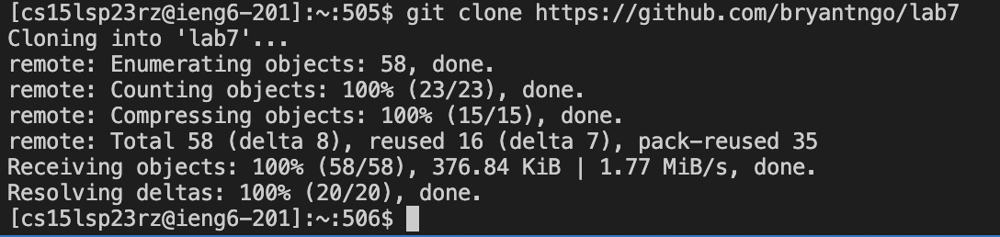
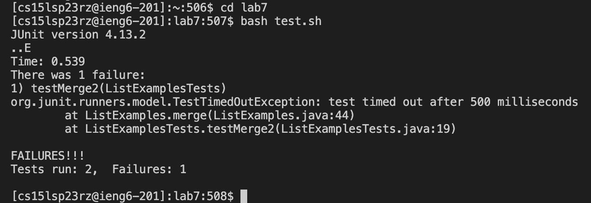
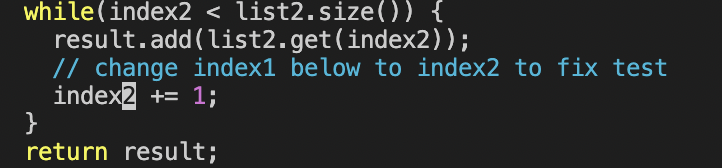
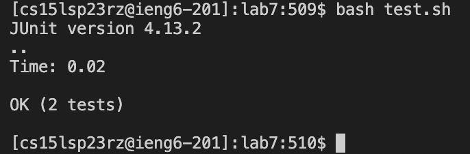
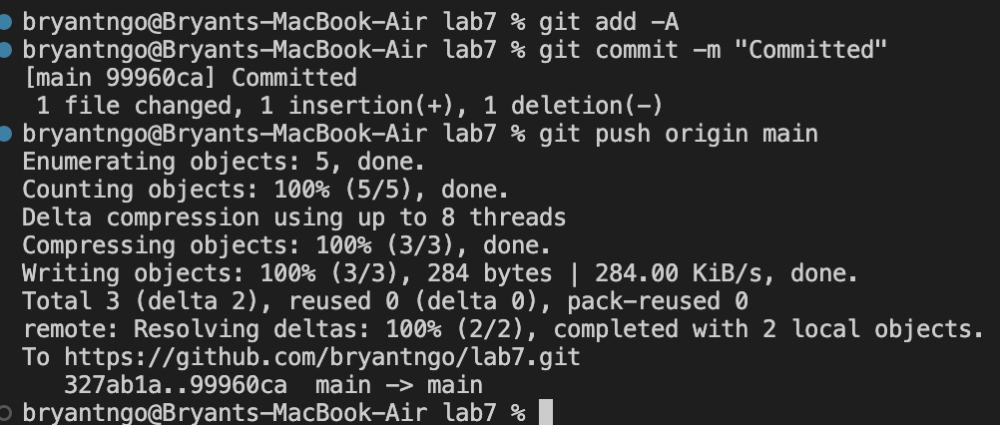

## Lab Report 4

# Step 4: 
Starting from Step 4, we must log into ssh from the terminal. In my case, I will run `$ ssh cs15lsp23rz@ieng6.ucsd.edu`.

# Step 5: 
We must run `$ git clone https://github.com/bryantngo/lab7` to clone my fork of the repository from my Github account. We are putting it into a folder called lab7 within the home directory.

# Step 6:
In order to show the test cases failing, we have to `$ cd lab7` into the cloned repository. We can now `$ bash test.sh` to run the bash script containing the test cases.

# Step 7:
To fix the test cases, we must fix the ListExamples.java file. In order to access the file, we can `$ vim ListExamples.java` to edit it. Depending on where the starting location that vim is on, I pressed `<j>` however much times was needed to get the line that needed to be changed. Since I was starting at the beginning of the file, I need to press `<j>` 33 times. Then, I pressed `<e>` to get the end out the first word (the 1 of index1). Afterwards, I press `<r>` to enter vim's replace mode, and finally `<2>` to replace the 1 into a 2. We can now save and exit the file with `:wq`.

# Step 8:
To test our new file, we can just go `<up> <up>` on the terminal to get to the `$ bash test.sh` or type it in manually. We should now see that our test cases pass after we `<enter>`.

# Step 9: 
We can now finally push this to the origin. To do so, we can `$ git add -A` which will add all changes to the commit. Next, we should make sure that the commit will be sent with `$ git commit -m <message>`. My message will say "Committed". We can now push the changes to GitHub with `$ git push origin main`(Be sure to have a valid SSH key to your GitHub account). Our terminal should now say something along the lines of :

You are now done and your changes will be seen on GitHub!
