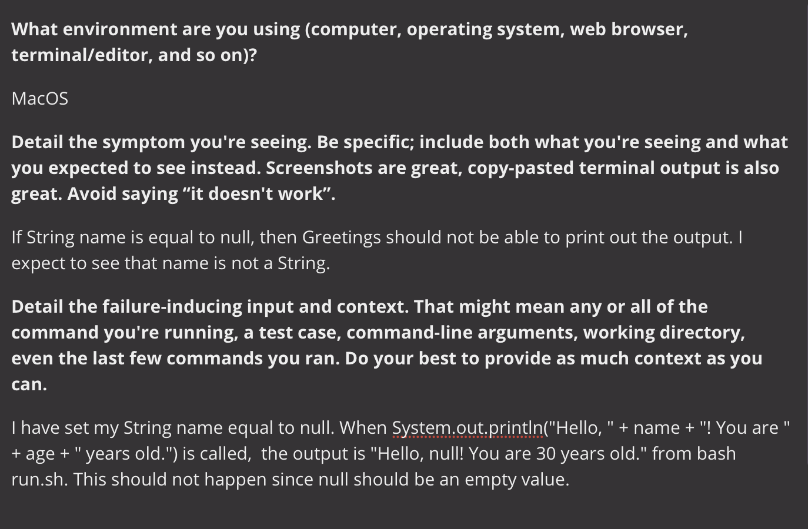
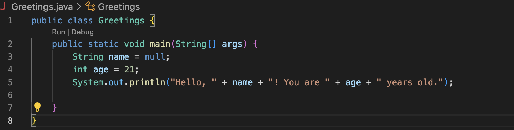
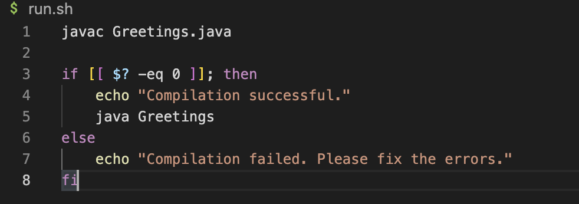
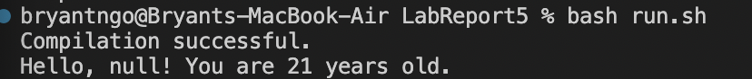
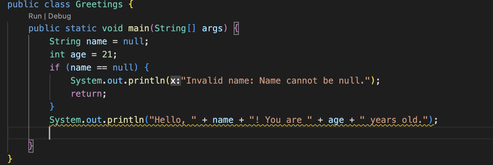

# Debugging Scenariot

## TA Reponse: 
You must run an if statement checking if name is equal to null and throwing either an IllegalArgumentException or printing an error message before the print message! 

## Fix: 

The bug is that in an attempt to concatenate name with the greeting message, in Java, when you concatenate null with the "+" operator, the null reference is converted to the string "null". The program always assumes that name will hold a valid value. 

# Reflection

In this class I learend how to remotely start a server either on my own local computer or the UCSD computer (ieng6). The use of vim can be very easily used to access around a file that I will be using in my future coding endeavors. I also learned how to write and execute bash scripts that can be used to execute a series of commands. All in all, CSE15L was a fun and interactive class that I will take with me for future classes.

