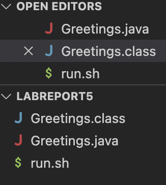
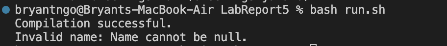

# Debugging Scenario

## TA Reponse: 
You must run an if statement checking if name is equal to null and throwing either an IllegalArgumentException or printing an error message before the print message! 

## Fix: 

